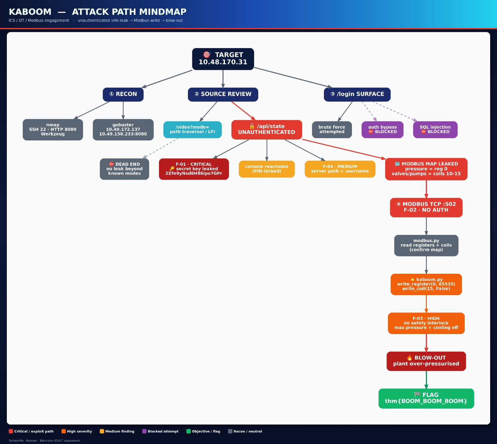

# CTF Reports

> "The quieter you become, the more you are able to hear."
> — Kali Linux motto

Penetration test reports for completed CTF / lab machines.

> ⚠️ **Note:** GitHub's in-browser viewer may fail to render these PDFs
> (`Error loading PDF page number 1`). **Please download the report to open it**, or use the **Viewer** link.
> ⚠️ **ملاحظة:** عارض GitHub قد يفشل في عرض الـ PDF داخل المتصفح — **حمّل التقرير لفتحه**، أو استخدم رابط **Viewer**.

## Reports

| Machine | View (in browser) | Download |
|---------|-------------------|----------|
| **Lookup** | [📄 GitHub](https://github.com/sohaebgamal/ctf_reports/blob/main/reports/Lookup/Lookup_Penetration_Test_Report.pdf) · [🌐 Viewer](https://docs.google.com/viewer?url=https://raw.githubusercontent.com/sohaebgamal/ctf_reports/main/reports/Lookup/Lookup_Penetration_Test_Report.pdf) | [⬇️ Download](https://raw.githubusercontent.com/sohaebgamal/ctf_reports/main/reports/Lookup/Lookup_Penetration_Test_Report.pdf) |
| **UltraTech** | [📄 GitHub](https://github.com/sohaebgamal/ctf_reports/blob/main/reports/UltraTech/UltraTech_Penetration_Test_Report.pdf) · [🌐 Viewer](https://docs.google.com/viewer?url=https://raw.githubusercontent.com/sohaebgamal/ctf_reports/main/reports/UltraTech/UltraTech_Penetration_Test_Report.pdf) | [⬇️ Download](https://raw.githubusercontent.com/sohaebgamal/ctf_reports/main/reports/UltraTech/UltraTech_Penetration_Test_Report.pdf) |
| **Kaboom** | [📄 GitHub](https://github.com/sohaebgamal/ctf_reports/blob/main/reports/Kaboom/Kaboom_Pentest_Report1.pdf) · [🌐 Viewer](https://docs.google.com/viewer?url=https://raw.githubusercontent.com/sohaebgamal/ctf_reports/main/reports/Kaboom/Kaboom_Pentest_Report1.pdf) | [⬇️ Download](https://raw.githubusercontent.com/sohaebgamal/ctf_reports/main/reports/Kaboom/Kaboom_Pentest_Report1.pdf) |
| **Blog** | [📄 GitHub](https://github.com/sohaebgamal/ctf_reports/blob/main/reports/Blog/Blog_Penetration_Test_Report.pdf) · [🌐 Viewer](https://docs.google.com/viewer?url=https://raw.githubusercontent.com/sohaebgamal/ctf_reports/main/reports/Blog/Blog_Penetration_Test_Report.pdf) | [⬇️ Download](https://raw.githubusercontent.com/sohaebgamal/ctf_reports/main/reports/Blog/Blog_Penetration_Test_Report.pdf) |

### Kaboom — Attack Path Mindmap

### ملاحظة
- **GitHub** = عارض GitHub المدمج (يفتح داخل الصفحة).
- **Viewer** = عارض Google احتياطي يعمل دائمًا لو فشل عارض GitHub.
- **Download** = رابط `raw` يُنزّل الملف مباشرة.
